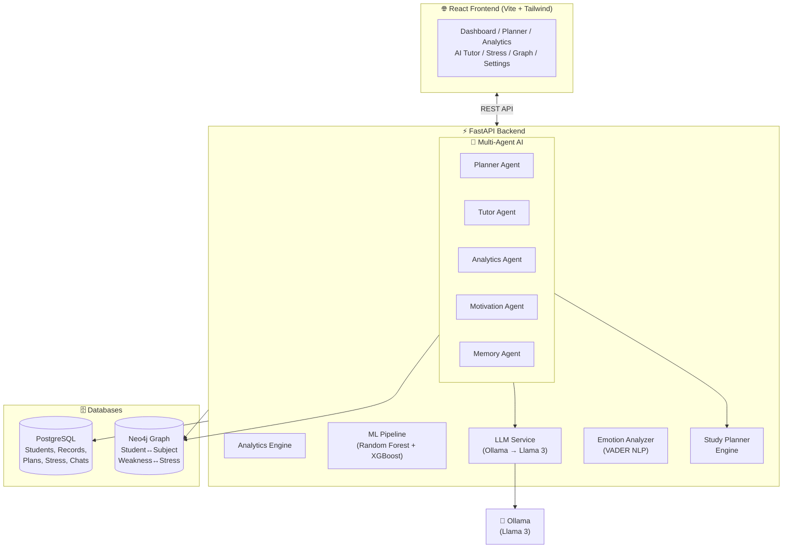

# 🧠 AI Memory Twin for Students

> A **futuristic AI-powered academic operating system** — full-stack React + FastAPI + PostgreSQL + Neo4j + Llama 3, Dockerized and demo-ready.

[](https://reactjs.org)
[](https://fastapi.tiangolo.com)
[](https://docs.docker.com/compose/)
[](https://neo4j.com)
[](https://postgresql.org)

---

## 🎯 Demo Ready - No Login Required

> **Instant access** — The app loads directly into the dashboard with demo data pre-loaded. No login or registration required.

---

## 🚀 Quick Start (One Command)

### Windows
```powershell
.\start.ps1
```

### Mac / Linux
```bash
bash start.sh
```

### Manual Docker Launch
```bash
docker compose up --build
```

**Services available after startup:**

| Service          | URL                          |
|------------------|------------------------------|
| 🌐 Frontend      | http://localhost:5173        |
| ⚡ Backend API   | http://localhost:8000        |
| 📚 Swagger Docs  | http://localhost:8000/docs   |
| 🔷 Neo4j Browser | http://localhost:7474        |
| 🐘 PostgreSQL    | localhost:5432               |
| 🤖 Ollama        | localhost:11434              |

---

## 📐 System Architecture



---

## 📁 Project Structure

```
AI Memory Twin for Students/
├── 🐳 docker-compose.yml        # Full stack orchestration
├── 📄 README.md
├── ▶️  start.ps1 / start.sh     # One-command launchers
│
├── frontend/                   # React.js + Vite + Tailwind CSS
│   ├── src/
│   │   ├── pages/              # Dashboard, Tutor, Analytics, Planner, Stress, Graph...
│   │   ├── components/         # Button, Input, Skeleton, EmptyState, Sidebar, Navbar
│   │   ├── context/            # AuthContext (demo user), ThemeContext (dark/light)
│   │   ├── services/           # api.js (Axios), index.js (all service functions)
│   │   └── App.jsx             # Router + providers
│   └── Dockerfile
│
└── backend/                    # FastAPI Python Backend
    ├── main.py                 # App entry + middleware + lifespan
    ├── config.py               # Pydantic settings
    ├── routes/                 # 10 router modules
    ├── models/                 # SQLAlchemy ORM (6 tables)
    ├── schemas/                # Pydantic schemas
    ├── services/               # llm, emotion, planner
    ├── ml/                     # Dataset gen + model training + predictor
    ├── agents/                 # Multi-agent orchestrator (5 agents)
    ├── neo4j/                  # Graph service
    ├── database/               # DB connection
    ├── utils/                  # Seed script + middleware
    └── Dockerfile
```

---

## 🔌 API Reference

| Module            | Endpoint                         | Method     |
|-------------------|----------------------------------|------------|
| **Academics**     | `/api/academics/`                | GET / POST |
|                   | `/api/academics/{id}`            | PUT / DEL  |
| **Planner**       | `/api/planner/history`           | GET        |
|                   | `/api/planner/generate`          | POST       |
|                   | `/api/planner/{id}`              | PUT / DEL  |
| **AI Tutor**      | `/api/tutor/chat`                | POST       |
|                   | `/api/tutor/quiz`                | POST       |
|                   | `/api/tutor/summarize`           | POST       |
|                   | `/api/tutor/history`             | GET        |
| **Analytics**     | `/api/analytics/dashboard`       | GET        |
|                   | `/api/analytics/performance`     | GET        |
|                   | `/api/analytics/stress`          | GET        |
| **Predictions**   | `/api/predict/weak-subject`      | GET        |
|                   | `/api/predict/burnout`           | GET        |
| **Stress**        | `/api/stress/`                   | GET / POST |
|                   | `/api/stress/analyze`            | POST       |
|                   | `/api/stress/report`             | GET        |
| **Graph**         | `/api/graph/student-map`         | GET        |
|                   | `/api/graph/performance-network` | GET        |
| **Notifications** | `/api/notifications/`            | GET        |
|                   | `/api/notifications/read-all`    | PUT        |
| **Agents**        | `/api/agents/run-cycle`          | POST       |
|                   | `/api/agents/motivation`         | POST       |
| **Health**        | `/health`                        | GET        |

---

## ⚙️ Environment Variables

Copy `backend/.env.example` → `backend/.env` and customize:

| Variable                          | Default                           | Description             |
|-----------------------------------|-----------------------------------|-------------------------|
| `DATABASE_URL`                    | `postgresql://...`                | PostgreSQL connection   |
| `NEO4J_URI`                       | `bolt://neo4j:7687`               | Neo4j bolt URI          |
| `NEO4J_PASSWORD`                  | `memorytwin_neo4j`                | Neo4j auth password     |
| `OLLAMA_HOST`                     | `http://ollama:11434`             | Ollama API host         |
| `OLLAMA_MODEL`                    | `llama3`                          | LLM model name          |
| `FRONTEND_ORIGIN`                 | `http://localhost:5173`           | CORS allowed origin     |

---

## 🧠 ML Pipeline

Models are automatically trained on first startup inside Docker. To retrain manually:

```bash
cd backend
python datasets/generate_data.py    # Generate 5000+ synthetic records
python ml/train_models.py           # Train Random Forest + Gradient Boosting
```

Saved models:
- `backend/ml/weak_subject_model.pkl` — predicts underperforming subjects
- `backend/ml/burnout_model.pkl` — estimates burnout probability

---

## 💻 Local Dev (without Docker)

### Backend
```bash
cd backend
python -m venv venv
venv\Scripts\activate           # Windows
pip install -r requirements.txt
# Set DATABASE_URL to local Postgres in .env
uvicorn main:app --reload --port 8000
```

### Frontend
```bash
cd frontend
npm install
npm run dev
```

---

## 🔧 Troubleshooting

| Issue | Solution |
|-------|----------|
| Neo4j won't start | Increase Docker memory to 4GB+ in Docker Desktop |
| Llama 3 not responding | Run: `docker exec memorytwin_ollama ollama pull llama3` |
| DB connection refused | Wait for postgres healthcheck: `docker compose ps` |
| Frontend can't reach backend | Ensure `VITE_API_URL=http://localhost:8000` in `frontend/.env` |
| ML predictions return heuristics | Run `python ml/train_models.py` inside the backend container |

---

## 📸 Screenshots

> *(Screenshots section — open the app at `http://localhost:5173` after launch)*

- **Dashboard** — Real-time GPA, attendance, stress, and weak subject alerts
- **AI Tutor** — Llama 3-powered chatbot with markdown rendering  
- **Analytics** — Multi-chart performance deep dive with CSV export
- **Study Planner** — AI-generated task lists with Pomodoro timer
- **Stress Monitor** — 7-day emotional trend analysis with wellness tips
- **Knowledge Graph** — Neo4j-powered subject relationship visualization
- **Settings** — Profile, AI persona, theme, and security management

---

## 🏆 Designed For

Final-year Computer Science / Information Technology students presenting an **enterprise-grade AI-powered academic platform** as a capstone or final year project.

Built with ❤️ using React, FastAPI, PostgreSQL, Neo4j, Llama 3, Docker.